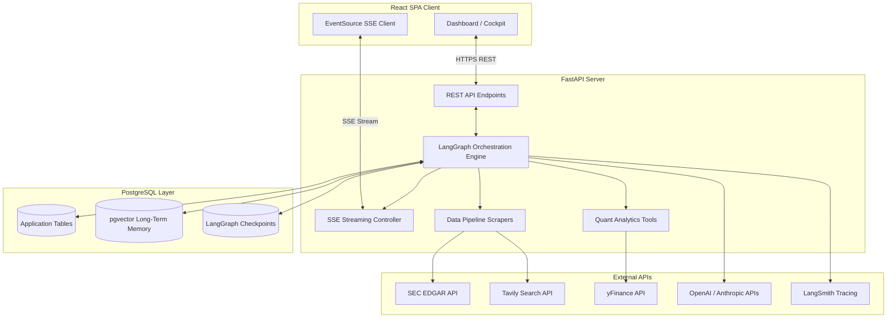
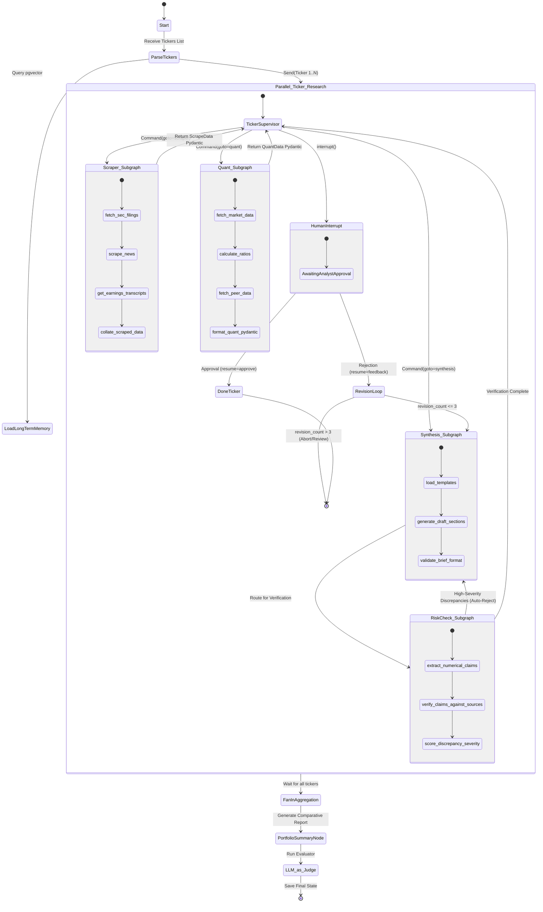
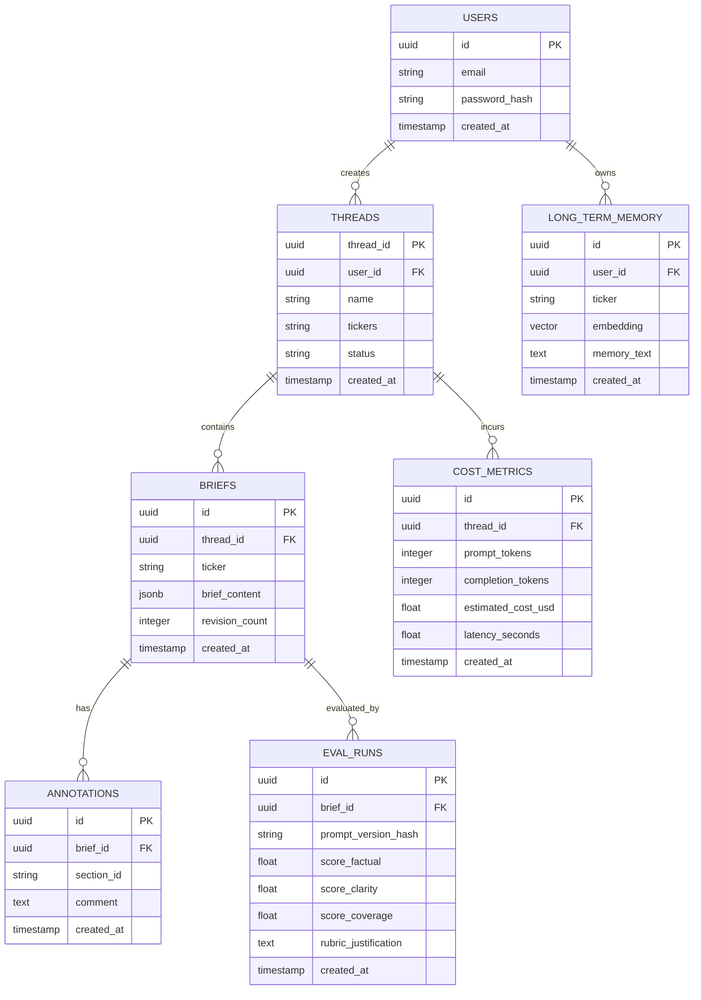

# Software Requirements Document (SRD)
## Project: AI-Powered Financial Research Analyst Platform

This document defines the software requirements, system architecture, database schema, and technical specifications for the **Financial Research Analyst Platform**. 

The platform is designed to automate complex equity research workflows by orchestrating a hierarchical multi-agent system in LangGraph. It leverages parallel executions for portfolio analysis, Postgres-backed long-term memory, human-in-the-loop review loops, real-time progress streaming, and an LLM-as-judge evaluation pipeline.

---

## 1. System Architecture

The platform uses a decoupled three-tier architecture:
1.  **Frontend (React)**: A modern responsive user interface using Tailwind CSS and Google Fonts (Inter/Outfit). Features a research cockpit, thread history panel, interactive brief editor with annotation capabilities, dynamic trace execution timeline (via SSE), and an analytics/observability dashboard.
2.  **Backend (FastAPI)**: A high-performance Python web server hosting the LangGraph agent engines, handling database connections, executing web scraping/financial tools, and streaming agent thoughts in real time via Server-Sent Events (SSE).
3.  **Database Layer (PostgreSQL)**:
    *   **LangGraph Checkpoint Database**: Utilizes `PostgresSaver` for cross-session state persistence and thread management.
    *   **Application Database**: Stores structured investment briefs, analyst annotations, user credentials, and evaluation metrics.
    *   **Vector Database (pgvector)**: Stores embeddings of past briefs, analyst annotations, and user preferences to facilitate semantic long-term memory retrieval.



---

## 2. LangGraph Agent Workflows

The system runs a **Hierarchical Multi-Agent Graph**. It consists of a top-level **Portfolio Graph** which receives a list of tickers, fans out in parallel using LangGraph's `Send` API to execute a **Ticker Research Graph** for each ticker, and fans back in to generate a comparative analysis.

All main worker units (Scraper, Quant, Synthesis, and Risk-Check) are implemented as nested **subgraphs** (`StateGraph` instances) rather than simple nodes, allowing complex internal processes, modular testing, and nested error containment.

### 2.1 Top-Level Portfolio Graph Flow
1.  **Entry Node**: Parses the list of tickers.
2.  **Memory Load Node**: Queries `pgvector` for past reports or analyst preferences related to these tickers.
3.  **Send Node**: Invokes parallel Ticker Research Graphs.
4.  **Fan-in/Aggregation Node**: Collects individual Pydantic briefs, runs correlation metrics, and synthesizes the final comparative portfolio summary.

### 2.2 Ticker Research Graph & Nested Subgraphs
Within each Ticker Research Graph, a local **Supervisor Node** routes tasks dynamically to nested subgraphs using the `Command` pattern.

*   **Scraper Subgraph**: Orchestrates web harvesting.
    *   *Internal Nodes*: `fetch_sec_filings` (SEC EDGAR API) -> `scrape_news` (Tavily/SerpAPI) -> `get_earnings_transcripts` -> `collate_scraped_data`.
*   **Quant Subgraph**: Processes quantitative analytics.
    *   *Internal Nodes*: `fetch_market_data` (`yfinance`) -> `calculate_ratios` (PE/EV ratios calculated inline) -> `fetch_peer_data` -> `format_quant_pydantic`.
*   **Synthesis Subgraph**: Generates structured reports.
    *   *Internal Nodes*: `load_templates` -> `generate_draft_sections` (LLM prompt synthesis) -> `validate_brief_format` (Pydantic parser).
*   **Risk-Check Subgraph**: Performs verification checks.
    *   *Internal Nodes*: `extract_numerical_claims` -> `verify_claims_against_sources` -> `score_discrepancy_severity`. If high severity issues are flagged, it instructs the Ticker Supervisor to reject the brief and return to the Synthesis Subgraph.
*   **Interrupt Node**: Halts Ticker Graph execution for analyst approval.
*   **Revision Loop**: If analyst rejects, graph resumes with annotations, routing back to the Synthesis Subgraph. Enforces a maximum of 3 revision loops.



---

## 3. Detailed Feature Specifications

### 01. Supervisor + Worker Multi-Agent Graph (Nested Subgraph Architecture)
*   **Description**: A top-level supervisor node in LangGraph coordinates routing. Each worker (Scraper, Quant, Synthesis, Risk-Check) is implemented as a nested `StateGraph` containing its own distinct sub-nodes.
*   **Implementation**: Utilizes LangGraph's dynamic `Command` routing instead of legacy conditional edges. The supervisor yields `Command(goto="subgraph_name", update={...})` to trigger worker subgraphs.
*   **Hierarchical State Management**: Worker subgraphs define local state interfaces using `TypedDict` and `Pydantic`. Outputs are mapped and merged back into the Ticker Supervisor state at the boundary, ensuring complete data encapsulation and namespace protection. Custom error boundaries wrap each subgraph to log failures independently.


### 02. Postgres-Backed Long-Term Memory
*   **Description**: Full graph state checkpointer persisting research runs, ticker histories, and analyst preferences.
*   **Implementation**: LangGraph uses `PostgresSaver` backed by `asyncpg` and a connection pool. 
*   **Long-Term Semantic Memory**: An embedding generator maps past research runs and feedback notes to a vector table using `pgvector`. A custom `SemanticMemoryRetriever` tool queries this vector space at the start of a run to retrieve contextual prompts (e.g., "The analyst historically dislikes high EV/EBITDA ratios in cyclical sectors").

### 03. Interrupt / Resume Flow
*   **Description**: Graph execution pauses before final brief publication to allow user annotation, approval, or rejection.
*   **Implementation**: Uses LangGraph's `interrupt()` function inside the Ticker Graph. The state is serialized to PostgreSQL. The analyst accesses the brief via the React UI, interacts with it, and issues a resume command. The backend resumes the graph with:
    ```python
    app.update_state(config, Command(resume={"action": "approve" | "reject", "feedback": feedback_model}))
    ```

### 04. Web Scraper Agent
*   **Description**: Gathers financial reports and news.
*   **Tools**:
    *   `fetch_sec_filing(ticker, form_type)`: Fetches SEC 10-K and 10-Q documents. Enforces a valid `User-Agent` header (e.g., `Company Name ContactEmail@domain.com`) as mandated by the SEC EDGAR API.
    *   `scrape_news(query, n_results)`: Employs Tavily Search API for financial news coverage.
    *   `get_earnings_transcript(ticker, quarter)`: Scrapes current public transcripts.
*   **Rate-Limiter**: Wraps scraper tools in a token-bucket rate limiter to comply with the SEC limit of 10 requests per second.

### 05. Quant Agent
*   **Description**: Processes market fundamentals and stock data.
*   **Tools**:
    *   `get_price_history(ticker, period)`: Extracts historical pricing via `yfinance`.
    *   `get_fundamentals(ticker)`: Fetches income statements, balance sheets, and cash flow data.
    *   `get_peer_comparison(ticker)`: Retrieves peer group multiples.
*   **Metrics Engine**: Automatically computes financial metrics (P/E, EV/EBITDA, Debt/Equity, ROE, Free Cash Flow Yield) and serializes them into structured Pydantic models.

### 06. Risk-Check Agent (Verification)
*   **Description**: Validates the numerical statements in the compiled brief against the raw quantitative and scraped data.
*   **Implementation**: 
    1.  Uses a regex extraction pattern combined with a prompt schema to isolate claims: `{"claim": "revenue grew by 15%", "value": 0.15, "source": "income_statement"}`.
    2.  Verifies the claim values mathematically against the database records.
    3.  Scores issues: Low (minor rounding difference), Medium (outdated value), High (complete hallucination).
    4.  If any **High** severity discrepancy is found, it triggers a conditional edge to auto-reject the draft and return it to the Synthesis Agent with a detailed error report.

### 07. Synthesis Agent
*   **Description**: Synthesizes the scraped and calculated quantitative findings into a structured investment brief.
*   **Implementation**: Orchestrates Claude 3.5 Sonnet / GPT-4o with structured formatting rules. The output is parsed into a Pydantic model (`InvestmentBrief`) with distinct fields for:
    *   Executive Summary
    *   Business & Operational Overview
    *   Financial Performance Analysis
    *   Key Risk Factors
    *   Analyst Valuation & Recommendation

### 08. Streaming Pipeline
*   **Description**: Provides real-time visibility into the multi-agent execution pipeline.
*   **Implementation**:
    *   FastAPI backend streams LangGraph `astream_events(..., version="v2")` to the client.
    *   The stream captures event types like `on_chat_model_stream` (for text token generation), `on_tool_start`, and `on_node_start`.
    *   Pushed via Server-Sent Events (SSE) using a `text/event-stream` interface.
    *   The React client consumes the events via `EventSource` and renders a live terminal interface alongside a nodes transition graph.

### 09. Research Session Management
*   **Description**: Persists research sessions using named threads.
*   **Implementation**: Each run is created with a `thread_id` linked to a user profile in the database. Users can navigate past sessions, compare reports of a ticker over time, and recall past evaluations.

### 10. Analyst Annotation & Revision Loop
*   **Description**: Facilitates collaborative refinement of the brief.
*   **Implementation**: When an analyst rejects a brief, they click specific sections in the UI to add comments. The JSON response (feedback model) is injected into the Synthesis Agent's prompt context during the revision phase.
*   **Max Iterations**: A `revision_count` variable is tracked in the graph state. If the graph loops back more than 3 times, it halts, bypasses the loop, and triggers an error state to prevent infinite token consumption.

### 11. Portfolio-Level Analysis
*   **Description**: Orchestrates multi-ticker comparative studies.
*   **Implementation**: Uses the `Send(subgraph, state)` API to fan-out to parallel Ticker Graphs. If a ticker graph fails, it is handled by an error boundary node that captures the stack trace, allowing the remaining tickers to proceed. The aggregation node compiles a portfolio metrics matrix.

### 12. Agent Observability & LangSmith
*   **Description**: Instrumenting logs, errors, and LLM cost.
*   **Implementation**: LangSmith is enabled via standard environmental configs. The backend wraps the LangGraph runs with trace metadata mapping to the `user_id` and `thread_id`. A custom middleware monitors prompt and completion tokens, calculating running costs using standard token rate models, saving them in the application database.

### 13. LLM-as-Judge Evaluation
*   **Description**: Evaluates and rates final briefs.
*   **Implementation**: An independent LLM evaluator rates completed briefs according to a structured rubric: Factual Accuracy, Narrative Clarity, and Risk Coverage. The evaluation metrics are saved to the `eval_runs` database table, mapped to the active synthesis prompt version hash, enabling prompt tuning monitoring.

---

## 4. Database Schema



---

## 5. API Specifications

### 5.1 REST Endpoints

#### 1. Start Research Thread
*   **Endpoint**: `POST /api/research/start`
*   **Request Body**:
    ```json
    {
      "tickers": ["AAPL", "MSFT"],
      "name": "Tech Giants Q3 Analysis"
    }
    ```
*   **Response Body**:
    ```json
    {
      "thread_id": "4b68ab3e-20ee-4911-8975-f982cf51e944",
      "status": "initiated"
    }
    ```

#### 2. Resume Thread (Analyst Decision)
*   **Endpoint**: `POST /api/research/resume`
*   **Request Body**:
    ```json
    {
      "thread_id": "4b68ab3e-20ee-4911-8975-f982cf51e944",
      "ticker": "AAPL",
      "action": "approve" | "reject",
      "annotations": [
        {
          "section_id": "risk_factors",
          "comment": "Incorporate the recent supply chain delays in Vietnam."
        }
      ]
    }
    ```
*   **Response Body**:
    ```json
    {
      "status": "resumed"
    }
    ```

#### 3. Fetch Brief Details
*   **Endpoint**: `GET /api/research/briefs/{thread_id}`
*   **Response Body**:
    ```json
    {
      "thread_id": "4b68ab3e-20ee-4911-8975-f982cf51e944",
      "briefs": [
        {
          "ticker": "AAPL",
          "content": {
            "executive_summary": "...",
            "business_overview": "...",
            "financial_analysis": "...",
            "risk_factors": "...",
            "verdict": "..."
          },
          "revision_count": 0,
          "status": "completed"
        }
      ]
    }
    ```

### 5.2 Server-Sent Events (SSE) Stream
*   **Endpoint**: `GET /api/research/stream/{thread_id}`
*   **Header**: `Accept: text/event-stream`
*   **Event Types emitted**:
    *   `node_start`: Emitted when an agent node initiates execution (e.g. `{"node": "scraper", "ticker": "AAPL"}`).
    *   `tool_start`: Emitted when an agent runs a tool (e.g. `{"tool": "fetch_sec_filing", "args": {"ticker": "AAPL", "form_type": "10-Q"}}`).
    *   `token_stream`: LLM generation chunks (e.g. `{"delta": "The company's liquid position..."}`).
    *   `node_complete`: Emitted when an agent node terminates.
    *   `interrupt`: Emitted when graph hits analyst review block.
    *   `error`: Emitted when a subgraph execution fails.

---

## 6. Technology Stack & Directory Structure

### 6.1 Tech Stack
*   **Frontend**: React (Vite, TS), Tailwind CSS, EventSource API, Lucide React Icons.
*   **Backend**: FastAPI, LangGraph, Python 3.11+, Pydantic v2, `yfinance`, `beautifulsoup4`, `tavily-python`.
*   **Checkpointer & DB Driver**: `langgraph-checkpoint-postgres`, `asyncpg`, `psycopg3`.
*   **Vector Engine**: `pgvector` extension configured in PostgreSQL.

### 6.2 Proposed Directory Structure

```text
financial-research-analyst/
├── backend/
│   ├── app/
│   │   ├── api/
│   │   │   ├── auth.py          # User management & JWT authentication
│   │   │   ├── research.py      # Research creation, resume, streaming endpoints
│   │   │   └── dashboard.py     # Analytics and observability metrics
│   │   ├── db/
│   │   │   ├── session.py       # PostgreSQL async connection pools
│   │   │   └── models.py        # SQLAlchemy application models
│   │   ├── graphs/
│   │   │   ├── state.py         # Global and sub-graph typed Pydantic states
│   │   │   ├── supervisor.py    # Top-level portfolio supervisor graph
│   │   │   └── workers/
│   │   │       ├── scraper.py   # Scraper StateGraph & tools (SEC, news)
│   │   │       ├── quant.py     # Quant StateGraph & tools (yFinance)
│   │   │       ├── synthesis.py # Synthesis StateGraph & models
│   │   │       └── risk_check.py# Claim validator StateGraph & validators
│   │   ├── services/
│   │   │   ├── vector_store.py  # pgvector memory services
│   │   │   └── evaluator.py     # LLM-as-judge scoring pipelines
│   │   └── main.py              # FastAPI app initialization
│   ├── tests/                   # Pytest integration tests
│   ├── requirements.txt         # Python dependencies
│   └── Dockerfile               # Backend containerization
├── frontend/
│   ├── src/
│   │   ├── components/
│   │   │   ├── Dashboard/       # Dashboard metrics & active threads list
│   │   │   ├── ResearchCockpit/ # Ticker triggers and live streaming console
│   │   │   ├── BriefReview/     # Interactive annotations and approval card
│   │   │   └── Analytics/       # Observability dashboard, latencies, & costs
│   │   ├── hooks/
│   │   │   └── useSSE.ts        # Custom EventSource streaming hook
│   │   ├── services/
│   │   │   └── api.ts           # Axios wrapper for REST communications
│   │   ├── App.tsx
│   │   └── main.tsx
│   ├── package.json             # Node dependencies
│   └── vite.config.ts           # Vite compilation configs
├── docker-compose.yml           # Local multi-container orchestration (FastAPI, React, Postgres + pgvector)
└── srd.md                       # Software Requirements Document
```
